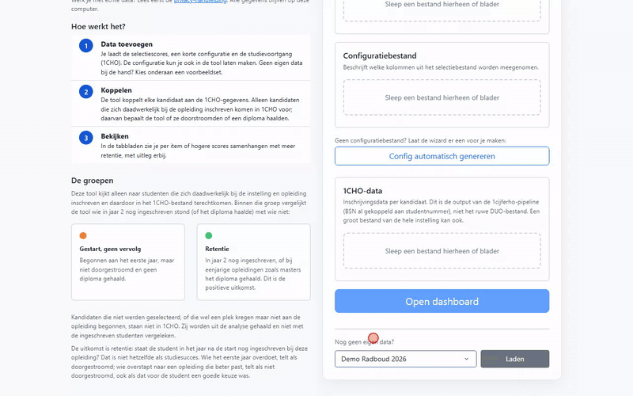

<div align="center">
  <h1>Selectie Evaluatietool</h1>

  <p>Onderzoek of je selectieprocedure voorspelt welke studenten doorgaan</p>

  <p>
    <a href="#"></a>
    <a href="#"></a>
    <a href="#"></a>
    
    
  </p>
</div>

---

<p align="center">
  
</p>

Veel opleidingen selecteren hun studenten met een toets, een gesprek, een
cijferlijst of een vragenlijst. De vraag die daarna vaak blijft liggen: **werkt
die selectie?** Staan de kandidaten die hoog scoorden na het eerste jaar ook
vaker nog ingeschreven?

Deze tool zoekt dat voor je uit. Je legt de selectiescores naast de
inschrijvingsgegevens uit 1CHO, en een dashboard laat per onderdeel van de
selectie zien of hogere scores samengaan met doorstuderen. Je krijgt grafieken,
toetsen en een PDF-rapport, met uitleg in gewone taal.

Deze handleiding neemt je mee van begin tot eind: van de bestanden die je bij
DUO en je eigen administratie ophaalt, tot het lezen van de uitkomsten. Hij is
geschreven voor data- en BI-teams in het hoger onderwijs. Programmeerkennis is
niet nodig; je moet wel een paar opdrachten kunnen kopiëren naar een
opdrachtvenster.


## Inhoud

- [Het hele traject in één oogopslag](#het-hele-traject-in-één-oogopslag)
- [Wat heb je nodig?](#wat-heb-je-nodig)
- [Stap 1. De tool installeren en uitproberen](#stap-1-de-tool-installeren-en-uitproberen)
- [Stap 2. De 1CHO-data klaarmaken met de 1cijferho-tool](#stap-2-de-1cho-data-klaarmaken-met-de-1cijferho-tool)
- [Stap 3. De selectiedata klaarzetten](#stap-3-de-selectiedata-klaarzetten)
- [Stap 4. Het configuratiebestand maken](#stap-4-het-configuratiebestand-maken)
- [Stap 5. Alles inladen en het dashboard openen](#stap-5-alles-inladen-en-het-dashboard-openen)
- [De uitkomsten lezen](#de-uitkomsten-lezen)
- [Als het niet lukt](#als-het-niet-lukt)
- [Volgend jaar opnieuw](#volgend-jaar-opnieuw)
- [Meer lezen](#meer-lezen)


## Het hele traject in één oogopslag

| Stap | Wat je doet | Wat je eraan overhoudt | Tijd, ongeveer |
|---|---|---|---|
| 1 | De tool installeren en met voorbeelddata uitproberen | Een werkende tool op je computer | 15 minuten |
| 2 | De 1CHO-levering van DUO omzetten met de 1cijferho-tool, samen met een koppelbestand BSN → studentnummer | Eén CSV-bestand met inschrijvingen, op studentnummer | 30 tot 60 minuten |
| 3 | Het Excel-bestand met selectiescores opvragen en nalopen | Eén Excel-bestand, één rij per kandidaat | Hangt af van de opleiding |
| 4 | Een configuratiebestand maken (de tool helpt je) | Een klein Excel-bestand dat je volgend jaar hergebruikt | 10 minuten |
| 5 | De drie bestanden inladen en het dashboard openen | Het dashboard en een PDF-rapport | 5 minuten |

Stap 1 en 2 doe je één keer per jaar voor de hele instelling. Stap 3 tot en met
5 doe je per opleiding.


## Wat heb je nodig?

**Op je computer**

- Windows, macOS of Linux.
- Toestemming om een programma te installeren (of iemand van ICT die dat voor
  je doet). De tool gebruikt het programma **uv**; dat haalt zelf de juiste
  versie van Python op. Je hoeft Python dus niet apart te installeren.
- Een internetverbinding tijdens de installatie. Daarna werkt alles lokaal: er
  gaan geen gegevens de deur uit.

**Gegevens**

| Wat | Waar haal je het vandaan | Verplicht? |
|---|---|---|
| De **1CHO-levering** van DUO: de EV-bestanden (`EV*.asc`), de bestandsbeschrijvingen (`Bestandsbeschrijving_*.txt`) en de decodeerbestanden (`Dec_*.asc`) | Je instelling ontvangt deze van DUO. Vraag de afdeling BI, institutioneel onderzoek of beleidsinformatie waar ze staan. | Ja |
| Een **koppelbestand BSN → studentnummer** | Een export uit je studentinformatiesysteem (bijvoorbeeld Osiris), met twee kolommen: burgerservicenummer en studentnummer | Ja |
| Het **selectiebestand** van de opleiding: één Excel-bestand met de scores per kandidaat | De opleiding, de selectiecommissie of het testbureau dat de selectie afnam | Ja |
| **VAKHAVW** (vakcijfers uit het voortgezet onderwijs) | Zit vaak in dezelfde DUO-levering | Nee, nog niet gebruikt (zie hieronder) |
| **Bekostigingsgegevens** | Staan in de EV-bestanden zelf (kolom `code_bekostiging`) | Nee, niet nodig |

> **Over VAKHAVW en bekostiging.** De tool gebruikt op dit moment alleen de
> EV-bestanden. VAKHAVW (cijfers per vak op de middelbare school) is
> interessant om te zien of de selectie iets toevoegt bovenop die cijfers; dat
> staat op de wensenlijst ([issue #1](https://github.com/cedanl/selectie-evaluatietool/issues/1)).
> De 1cijferho-tool zet VAKHAVW-bestanden standaard ook om. Dat kan geen kwaad,
> maar je hoeft er niets mee te doen. Bekostiging speelt in deze analyse geen
> rol: de tool kijkt naar wie er in jaar 2 nog ingeschreven staat, bekostigd of
> niet.

> **Privacy.** Je werkt met persoonsgegevens. Lees vóór je met echte data
> begint de [privacy-handleiding](docs/privacy-handleiding.md). Die bevat een
> checklist om met je privacy officer of FG door te nemen.


## Stap 1. De tool installeren en uitproberen

### Een opdrachtvenster openen

Een paar stappen doe je in een *opdrachtvenster*: een venster waarin je een
opdracht typt en op Enter drukt. Op Windows heet dat PowerShell, op een Mac
heet het Terminal.

- **Windows:** druk op de Windows-toets, typ `PowerShell` en druk op Enter.
- **Mac:** druk op Cmd + spatie, typ `Terminal` en druk op Enter.

Een handige manier om een opdrachtvenster meteen *in de goede map* te openen
op Windows: open de map in Verkenner, klik in de adresbalk bovenin, typ
`powershell` en druk op Enter.

### uv installeren (eenmalig)

Kopieer de regel die bij jouw computer hoort, plak hem in het opdrachtvenster
(rechtermuisknop plakt in PowerShell) en druk op Enter.

Windows:

```powershell
powershell -ExecutionPolicy ByPass -c "irm https://astral.sh/uv/install.ps1 | iex"
```

Mac of Linux:

```bash
curl -LsSf https://astral.sh/uv/install.sh | sh
```

Sluit het opdrachtvenster daarna en open een nieuw venster; pas dan kent het de
opdracht `uv`. Staat uv al op je computer, dan kun je deze stap overslaan.

### De tool downloaden

1. Download het ZIP-bestand:
   [selectie-evaluatietool-master.zip](https://github.com/cedanl/selectie-evaluatietool/archive/refs/heads/master.zip).
2. Pak het uit op een plek die je terugvindt, bijvoorbeeld in `Documenten`. Je
   krijgt een map `selectie-evaluatietool-master`.

Werk je met Git, dan kan het ook zo:
`git clone https://github.com/cedanl/selectie-evaluatietool.git`.

### De tool starten

Open een opdrachtvenster in de map `selectie-evaluatietool-master` (zie de tip
hierboven) en typ:

```bash
uv run python app.py
```

De eerste keer duurt dit een paar minuten: uv haalt Python en de onderdelen op
die de tool nodig heeft. Daarna start de tool binnen enkele seconden. Je ziet
een regel met `Running on http://127.0.0.1:8050`.

Open je webbrowser en ga naar **<http://localhost:8050>**. De tool draait nu
op je eigen computer; het adres werkt alleen op deze computer.

**Stoppen:** klik in het opdrachtvenster en druk op Ctrl + C, of sluit het
venster. **Opnieuw starten:** dezelfde opdracht, in dezelfde map.

### Uitproberen met voorbeelddata

Onderaan het uploadscherm staat **Nog geen eigen data?**. Kies een van de twee
voorbeelden en klik op **Laden**:

- **Demo Leiden 2026**: een eenjarige master (Farmacie, 140 kandidaten). De
  uitkomst is of de student het diploma haalde.
- **Demo Radboud 2026**: een bachelor (Psychologie, 200 kandidaten). De
  uitkomst is of de student in jaar 2 nog ingeschreven stond.

Beide datasets zijn verzonnen. Klik gerust overal doorheen; zo weet je bij je
eigen data al wat je te zien krijgt.


## Stap 2. De 1CHO-data klaarmaken met de 1cijferho-tool

### Wat 1CHO is, en waarom je het eerst moet omzetten

1CHO ("1 Cijfer Hoger Onderwijs") is de landelijke registratie van
inschrijvingen en diploma's in het hoger onderwijs, beheerd door DUO. Je
instelling ontvangt daar jaarlijks een levering van. Daaruit haalt deze tool
wie er begonnen is aan de opleiding en wie er het jaar daarna nog stond.

De levering van DUO is niet direct bruikbaar:

- De gegevens staan in bestanden met vaste kolombreedtes (`.asc`) zonder
  kolomnamen; de beschrijving staat in losse tekstbestanden.
- Veel gegevens zijn codes (vooropleiding `00405`, opleiding `56560`); de
  omschrijvingen staan in aparte decodeerbestanden.
- Studenten staan op **BSN**, niet op het studentnummer dat in je
  selectiebestand staat.

De [1cijferho-tool](https://github.com/cedanl/1cijferho) van CEDA lost alle
drie op. Je zet de DUO-bestanden in een map, geeft een koppelbestand mee, en
krijgt een net CSV-bestand terug met leesbare kolommen en het studentnummer
erbij.

### 2a. Het koppelbestand maken

Vraag uit je studentinformatiesysteem een lijst op met twee kolommen, en sla
die op als CSV met puntkomma's:

```csv
burgerservicenummer;studentnummer
123456789;1234567
234567890;1234568
```

Let op drie dingen:

- **Kolomnamen precies zo:** `burgerservicenummer` en `studentnummer`, kleine
  letters. Heten ze anders, dan kun je dat in de 1cijferho-tool opgeven onder
  *Geavanceerde kolominstellingen koppelbestand*.
- **Voorloopnullen bewaren.** Een BSN heeft negen cijfers, ook als het met een
  0 begint. Open en bewaar dit bestand niet in Excel: Excel haalt voorloopnullen
  weg. Laat de export direct als CSV maken, of kijk het na in Kladblok.
- **Hetzelfde studentnummer als in het selectiebestand.** Dat is het nummer
  waarmee de tool de twee bestanden aan elkaar koppelt. Staat in het
  selectiebestand `1234567`, dan moet hier ook `1234567` staan (niet
  `s1234567`, niet `01234567`).

Neem alle studenten op die in de periode van je 1CHO-levering ingeschreven
stonden. Dubbele BSN's mogen niet voorkomen; de 1cijferho-tool stopt dan met
een melding.

### 2b. De 1cijferho-tool installeren en starten

Download de 1cijferho-tool
([ZIP-bestand](https://github.com/cedanl/1cijferho/archive/refs/heads/main.zip))
en pak hem uit, bijvoorbeeld naast de map van deze tool. Open een
opdrachtvenster in de map `1cijferho-main` en typ:

```bash
uv sync --extra frontend
uv run streamlit run src/main.py
```

De tool opent vanzelf in je browser. (Op Windows kun je hem daarna ook starten
door te dubbelklikken op `CEDA-run.bat` in die map.)

### 2c. De DUO-bestanden erin zetten

1. Kopieer de uitgepakte DUO-bestanden **rechtstreeks** naar de map
   `data\01-input` in de 1cijferho-map (niet in een submap). Dat zijn de
   `EV*.asc`-bestanden, de `Bestandsbeschrijving_*.txt`-bestanden en de
   `Dec_*.asc`-bestanden. Staan er ook `VAKHAVW*.asc`-bestanden bij, dan mogen
   die er ook in.
2. Zet het koppelbestand in de map `data`, bijvoorbeeld als
   `data\koppeling.csv`.

### 2d. De omzetting uitvoeren

In de 1cijferho-tool in je browser:

1. Kies op de startpagina **Eigen data uploaden** (niet *Probeer met demo*).
2. Klik op **Bestanden controleren**. De tool telt de gevonden bestanden. Klik
   op **Ga door naar stap 1 →**.
3. **Stap 1, Metadata extraheren:** klik op **Extraheren starten** en daarna op
   **Ga door naar stap 2 →**.
4. **Stap 2, Metadata valideren:** klik op **Validatie starten** en daarna op
   **Ga door naar stap 3 →**.
5. **Stap 3, Turbo Conversie:** hier kies je de instellingen.
   - Kies bij **Instelmodus** de optie **Evaluatietool Selectie**. Die zet alles
     goed voor deze tool: de EV-bestanden worden omgezet, vooropleiding,
     opleidingsnaam en geslacht krijgen leesbare omschrijvingen, en de
     kolomnamen krijgen de vorm die deze tool verwacht.
   - Vul bij **Pad naar koppelbestand** in: `data/koppeling.csv` (of waar je
     het bestand hebt neergezet). De tool laat zien welke kolommen hij vindt.
   - Klik op **⚡ Start Turbo Convert ⚡**.

Bij een levering van de hele instelling duurt dit een paar minuten.

<details>
<summary>Liever zonder browser? Hetzelfde in één opdracht.</summary>

```bash
uv run eencijferho pipeline --input data/01-input --output data/02-output --bsn-mapping-file data/koppeling.csv
```

Dit decodeert en verrijkt alle kolommen (meer dan de preset), wat voor deze
tool ook goed werkt.
</details>

### 2e. Het goede bestand kiezen

In de map `data\02-output` staan nu per EV-bestand een paar varianten. Voor
deze tool gebruik je:

| Bestand | Gebruiken? |
|---|---|
| `EV..._enriched.csv` | **Ja, dit is het bestand.** |
| `EV..._decoded.csv` | Ook goed |
| `EV....csv` (zonder toevoeging) | Nee: daarin staan alleen codes, zonder vooropleiding of opleidingsnaam |
| `.parquet`-bestanden | Nee: die leest deze tool niet |
| `VAKHAVW...`-bestanden | Nee, niet nodig |

Een paar dingen om na te lopen voor je verdergaat:

- **Staat er een kolom `studentnummer` in?** Die zet de 1cijferho-tool erbij
  als het koppelen gelukt is. Deze tool gebruikt die kolom automatisch. Zonder
  die kolom vindt de tool straks geen enkele kandidaat terug.
- **Loopt de levering ver genoeg door?** Om te zien wie er in jaar 2 nog
  stond, moet het bestand ook het studiejaar ná de start bevatten. Wil je het
  cohort dat in september 2025 begon evalueren, dan heb je een levering nodig
  met inschrijvingen in studiejaar 2026-2027 erin.
- **Het mag groot zijn.** Een bestand van de hele instelling, met alle
  opleidingen en jaren, is prima (tot 4 GB). De tool vraagt bij het inladen
  welke opleiding bij je selectie hoort en leest alleen de kolommen die hij
  nodig heeft. Het BSN wordt niet ingelezen.

Je kunt dit ene bestand gebruiken voor alle opleidingen die je evalueert.


## Stap 3. De selectiedata klaarzetten

Het selectiebestand komt van de opleiding. Het is een Excel-bestand (`.xlsx`
of `.xls`) waarin elke rij een kandidaat is en de kolommen de scores bevatten.
Er is geen vast formaat: elke opleiding heeft haar eigen bestand, en dat is de
bedoeling. Het configuratiebestand (stap 4) vertelt de tool hoe dit bestand in
elkaar zit.

**Wat er in moet staan**

- **Alle kandidaten die aan de selectie meededen**, ook wie is afgewezen of
  niet is begonnen. Die zijn nodig voor het totaalbeeld; de tool deelt ze zelf
  in als *niet gestart*.
- **Eén rij per kandidaat.** Staat iemand twee keer in het bestand met
  dezelfde scores, dan telt de tool die kandidaat één keer (met een
  waarschuwing). Staat
  iemand er twee keer in met *verschillende* scores, dan stopt de tool: dan moet
  eerst duidelijk zijn welke rij klopt.
- **Een kolom met het studentnummer**, in precies dezelfde schrijfwijze als in
  het koppelbestand van stap 2. Gebruikt de opleiding een aanvraagnummer uit
  Studielink of een eigen kandidaatnummer, vraag dan om het studentnummer erbij.
- **De scores als getallen.** Elke kolom mag een eigen schaal hebben (1 tot 5,
  een cijfer, een percentage). Een komma of punt als decimaalteken maakt niet
  uit, zolang Excel het als getal ziet.

**Wat er niet in hoeft**

- Namen, e-mailadressen, adressen en vrije opmerkingen. De tool analyseert ze
  niet, maar leest ze wel in. Haal ze er liever uit voor je het bestand
  gebruikt; zie de [privacy-handleiding](docs/privacy-handleiding.md).
- Opmaak, kleuren, extra tabbladen of een titel boven de tabel: allemaal geen
  probleem. Je geeft in de config aan welk tabblad en welke rij met kolomnamen
  de tool moet lezen.

**Twee valkuilen die de uitkomsten vertekenen**

- **Subtotalen naast hun onderdelen.** Staat er een kolom *Subtotaal gesprek*
  naast de kolommen waaruit hij is opgeteld, neem dan óf het subtotaal óf de
  onderdelen mee, niet allebei. Anders telt dezelfde informatie dubbel. De
  configuratiewizard herkent de meeste subtotalen en vinkt ze standaard uit.
- **Twee versies van dezelfde score.** Bijvoorbeeld *percentage goed* en
  *aantal goed* van dezelfde toets. Kies er één.

Meer voorbeelden van selectiebestanden staan in de
[data-handleiding](docs/data-handleiding.md).


## Stap 4. Het configuratiebestand maken

Het configuratiebestand is een klein Excel-bestand met twee tabbladen. Het
vertelt de tool:

- op welk tabblad en in welke rij van je selectiebestand de kolomnamen staan;
- welke kolom het studentnummer is;
- welke kolommen scores zijn die meetellen, en hoe ze in het dashboard heten;
- om welke opleiding, instelling en welk jaar het gaat.

Je maakt het één keer per opleiding. Volgend jaar kun je het hergebruiken, zolang
het selectiebestand er hetzelfde uitziet.

### De makkelijke manier: de wizard

1. Start de tool en upload in het uploadscherm eerst je **selectiebestand**
   (het eerste vak).
2. Klik op **Config automatisch genereren**. Er opent een scherm dat je
   selectiebestand leest en zoveel mogelijk zelf invult.
3. Loop bovenin na wat de wizard heeft gevonden:
   - **Blad:** het tabblad met de scores.
   - **Headerrij:** de rij waarop de kolomnamen staan. Staat er een titel of
     een lege regel boven, dan is dit bijvoorbeeld 3 in plaats van 1.
   - **Opleiding, Instelling, Selectiejaar:** worden geraden uit de
     bestandsnaam; pas ze aan waar nodig. Bij **Selectiejaar** vul je het jaar in
     waarin de geselecteerde studenten begonnen (2025 voor de start in
     september 2025).
   - **ID-kolom:** de kolom met het studentnummer.
4. Daaronder staat een tabel met **alle kolommen** uit je bestand. Voor elke
   kolom zie je:
   - een **vinkje** vooraan: aangevinkt betekent *dit is een score die meetelt*.
     De wizard vinkt de kolommen aan die op scores lijken en laat
     studentnummers, namen, datums en subtotalen uit. Controleer dit goed; het is
     de belangrijkste keuze in de hele config.
   - **instrument:** het meetmiddel waar de score bij hoort (bijvoorbeeld
     *Gesprek*, *Schooldiploma*, *Capaciteitentest*). Kolommen van hetzelfde
     instrument krijgen dezelfde naam; dat wordt een filter in het dashboard.
   - **item:** een leesbare naam voor de score, zoals die in grafieken en het
     rapport komt (*Gespreksbeoordeling beoordelaar 1* in plaats van
     `C_B1_Sc_Gesp`). Elke aangevinkte kolom moet een eigen itemnaam hebben.
   - **criterium** (optioneel): wat het item meet, bijvoorbeeld
     *Communicatievaardigheid*. Mag leeg.
   - **schaal** (optioneel): het bereik, zoals `1-5` of `0-100`. Alleen ter
     documentatie.
5. Klik op **Bevestig config**, en daarna op **Download als Excel**. Bewaar
   dat bestand bij het selectiebestand; volgend jaar upload je het gewoon in
   het tweede vak en sla je de wizard over.

De wizard kan meldingen tonen zoals *Let op: mogelijk dubbele informatie*
(twee kolommen die vrijwel hetzelfde meten) of een uitleg over subtotalen. Dat
zijn geen fouten, maar punten om zelf te beoordelen.

### De handmatige manier

Open [`docs/config_template.xlsx`](docs/config_template.xlsx). Het tabblad
*uitleg* legt elk veld uit, en in de cellen staan opmerkingen met voorbeelden.

Tabblad **instellingen**:

| Veld | Wat je invult | Voorbeeld |
|---|---|---|
| `koppel_id_kolom` | De exacte naam van de kolom met het studentnummer | `Studentnummer` |
| `opleiding` | Naam van de opleiding, zoals die in het dashboard moet staan | `Psychologie` |
| `instellingscode` | Naam of BRIN-code van de instelling (optioneel) | `Radboud Universiteit` |
| `jaar` | Het jaar waarin de geselecteerde studenten begonnen | `2025` |
| `blad_naam` | De exacte naam van het tabblad met de scores | `Scores en ranking` |
| `header_rij` | Op welke rij de kolomnamen staan (meestal 1) | `3` |
| `totaalscore_kolom` | Naam van een totaalscorekolom, als die er is (optioneel) | `Totale selectiescore %` |

Tabblad **kolommen**: één rij per kolom in je selectiebestand, met
`meenemen` (WAAR of ONWAAR), `kolom_naam` (exact overgenomen), `instrument`,
`item`, `criterium` en `schaal`.

Kolomnamen moeten letterlijk overeenkomen met het selectiebestand, inclusief
hoofdletters en spaties. Een kopieerfout is de meest voorkomende reden dat de
controle bij het inladen een kolom niet vindt.


## Stap 5. Alles inladen en het dashboard openen

1. Start de tool (`uv run python app.py`) en ga naar <http://localhost:8050>.
2. Upload de drie bestanden in de vakken van het uploadscherm:
   - **Selectiedata:** het Excel-bestand van stap 3.
   - **Configuratiebestand:** het bestand van stap 4 (of gebruik de wizard).
   - **1CHO-data:** het `_enriched.csv`-bestand van stap 2.
3. De tool controleert alles en laat onder de vakken zien wat hij vond:
   - groen: in orde;
   - geel: een waarschuwing, bijvoorbeeld kandidaten die dubbel in het bestand
     staan of inschrijvingen van eerdere jaren die zijn overgeslagen;
   - rood: dit moet eerst opgelost (zie [Als het niet lukt](#als-het-niet-lukt)).
4. Bevat het 1CHO-bestand meerdere opleidingen, dan vraagt de tool: **Welke
   opleiding in het 1CHO-bestand hoort bij deze selectie?** Kies de opleiding
   uit de lijst.
5. Je ziet hoeveel kandidaten er gekoppeld zijn, bijvoorbeeld *70 van 200
   kandidaten gekoppeld*. Dat de rest niet gekoppeld is, is normaal: dat zijn
   kandidaten die zijn afgewezen of niet begonnen.
6. Klik op **Open dashboard**.

**Het dashboard**

| Tabblad | Wat je ziet |
|---|---|
| **Introductie** | Wat de tool doet en hoe je de tabbladen leest |
| **Wat valt op** | Een automatische samenvatting van de opvallendste bevindingen, met vervolgstappen voor beleid |
| **Selectiescores** | Boxplots per selectieonderdeel: scoorden studenten die doorgingen hoger? Ook uit te splitsen naar geslacht of vooropleiding |
| **Demografie** | Per achtergrondkenmerk welk deel van de studenten doorging |
| **Verschiltoets** | Per onderdeel: is het verschil groter dan toeval? Plus een tabel met het percentage dat doorging per scoregroep |
| **Correlatie** | Welke onderdelen grotendeels hetzelfde meten |
| **Regressie** | Welke onderdelen samen het beste voorspellen wie doorgaat |

Met **Download rapport (PDF)** links krijg je alles in één document om te delen
met de opleiding of een commissie. Het maken duurt ongeveer een halve minuut.

Klaar? Klik op **Nieuw bestand laden** voordat je de tool afsluit. Dan wordt het
geüploade 1CHO-bestand direct van je computer verwijderd (anders gebeurt dat na
24 uur).


## De uitkomsten lezen

**Wat de tool meet.** De uitkomst is *retentie*: staat de student in het jaar na
de start nog ingeschreven bij deze opleiding? Bij een eenjarige master is het:
is het diploma in dat jaar gehaald? Dat is niet hetzelfde als studiesucces. Wie
het eerste jaar overdoet, telt als doorgegaan; wie overstapt naar een
opleiding die beter past, telt als niet doorgegaan.

**De groepen.** Elke kandidaat valt in een van deze groepen:

| Groep | Betekenis |
|---|---|
| **Niet gestart** | Staat niet in 1CHO bij deze opleiding: afgewezen, of wel toegelaten maar niet begonnen. Deze groep zit niet in de vergelijking. |
| **Gestart, niet naar jaar 2** | Begonnen, maar het jaar daarna niet meer ingeschreven (en geen diploma) |
| **Doorgestroomd naar jaar 2** | Het jaar na de start nog ingeschreven |
| **Gestart, diploma gehaald** | Bij een eenjarige master: diploma gehaald in het jaar van de start |

De analyses vergelijken alleen studenten die begonnen zijn: wie doorging met
wie niet.

**Lees de uitkomsten met deze kanttekeningen**

- **Kleine groepen.** Een opleiding met 70 gestarte studenten kan alleen
  flinke verschillen betrouwbaar aantonen. Het tabblad *Wat valt op* zegt hoe
  groot een verschil moet zijn om het te kunnen zien.
- **"Niet significant" is niet "werkt niet".** Alleen toegelaten studenten
  hebben een uitkomst, en hun scores liggen dicht bij elkaar. Daardoor lijkt
  elk verband zwakker dan het in de hele kandidatengroep is. Schrap dus geen
  selectieonderdeel omdat de tool er in één jaar niets bij vond.
- **Eén jaar is een momentopname.** Herhaal de analyse met een volgend cohort
  voordat je de procedure aanpast.
- **Kleine aantallen zijn afgeschermd.** Groepen van minder dan vijf studenten
  tonen we als `< 5`, zodat niemand herkenbaar is.
- **Achtergrond.** Geslacht en vooropleiding komen uit 1CHO en zijn dus alleen
  bekend voor wie begonnen is. Of de selectie bepaalde groepen vaker afwijst,
  kan de tool niet zien.


## Als het niet lukt

| Wat je ziet | Wat er meestal aan de hand is | Wat je doet |
|---|---|---|
| **Geen overlap tussen selectiedata en 1CHO-data** | De studentnummers in de twee bestanden komen niet overeen | Staat er een kolom `studentnummer` in het 1CHO-bestand? Zo niet: draai de 1cijferho-tool opnieuw mét koppelbestand (stap 2a en 2d). Zo wel: vergelijk een paar nummers uit beide bestanden (voorloopnullen, een letter ervoor). |
| **Ontbrekende achtergrondkolommen in 1CHO** | Je hebt het EV-bestand zonder toevoeging geüpload | Gebruik het bestand dat eindigt op `_enriched.csv` (stap 2e) |
| **Ontbrekende kolommen in 1CHO** | Dit is geen EV-bestand uit de 1cijferho-tool, of de kolomnamen zijn aangepast | Upload het `_enriched.csv`-bestand zoals het uit de 1cijferho-tool kwam; open en bewaar het niet eerst in Excel |
| **Blad '…' niet gevonden**, **ID-kolom '…' niet gevonden** of een kolom uit de config die niet gevonden wordt | Tikfout in een naam, verkeerd tabblad of verkeerde headerrij | Laat de wizard de config opnieuw maken, of kopieer de naam letterlijk uit het selectiebestand |
| **… komen bij meer dan één kolom voor** | Twee aangevinkte kolommen hebben dezelfde itemnaam | Geef elk item een eigen naam |
| **… staan meerdere keren in de selectiedata met verschillende scores** | Iemand staat twee keer in het selectiebestand, met andere scores | Zoek uit welke rij klopt en verwijder de andere |
| Bijna iedereen valt in **Gestart, niet naar jaar 2** | De 1CHO-levering bevat het jaar ná de start nog niet | Gebruik een levering waar dat jaar in zit (stap 2e) |
| `uv` **wordt niet herkend** | Het opdrachtvenster was al open tijdens de installatie | Sluit het venster en open een nieuw |
| De browser kan **localhost niet bereiken** | De tool draait niet (meer) | Kijk in het opdrachtvenster of er een foutmelding staat en start opnieuw met `uv run python app.py` |
| In het opdrachtvenster staat dat **port 8050 in use** is (of *address already in use*) | De tool draait al in een ander venster | Gebruik dat venster, of sluit het en start opnieuw |

Kom je er niet uit, maak dan een
[issue](https://github.com/cedanl/selectie-evaluatietool/issues) aan. Stuur nooit
echte gegevens mee; een schermafdruk van de melding is genoeg.


## Volgend jaar opnieuw

1. Download de nieuwste versie van de tool (stap 1) en van de 1cijferho-tool.
2. Zet de nieuwe DUO-levering om met een bijgewerkt koppelbestand (stap 2).
3. Vraag het nieuwe selectiebestand op. Is het net zo opgebouwd als vorig
   jaar, dan hergebruik je de config; pas alleen het `jaar` aan. Zijn er
   kolommen bijgekomen of hernoemd, laat de wizard dan een nieuwe maken.
4. Laad alles in en vergelijk de uitkomsten met vorig jaar. Een patroon dat
   twee jaar achter elkaar terugkomt, is een steviger basis voor een besluit
   dan één jaar.


## Meer lezen

- [Data-handleiding](docs/data-handleiding.md): de bestanden in detail, met
  voorbeelden.
- [Privacy-handleiding](docs/privacy-handleiding.md): wat de tool met gegevens
  doet, en een checklist voor je FG.
- [Configuratiesjabloon](docs/config_template.xlsx): lege config met uitleg per
  cel.
- [1cijferho-tool](https://github.com/cedanl/1cijferho) en de
  [documentatie](https://cedanl.github.io/1cijferho/).

<details>
<summary>Voor ontwikkelaars</summary>

```bash
uv sync
uv run python app.py          # dashboard op localhost:8050 (DASH_DEBUG=1 voor de debugger)
uv run pytest -q              # tests
uv run ruff format . && uv run ruff check --fix .
```

De opbouw van de code en de methodologische keuzes staan in
[CLAUDE.md](CLAUDE.md).
</details>

---

<div align="center">
  <sub>Ontwikkeld door <a href="https://github.com/cedanl">CEDA NL</a> · <a href="docs/data-handleiding.md">Data-handleiding</a> · <a href="docs/privacy-handleiding.md">Privacy-handleiding</a> · MIT-licentie</sub>
</div>
